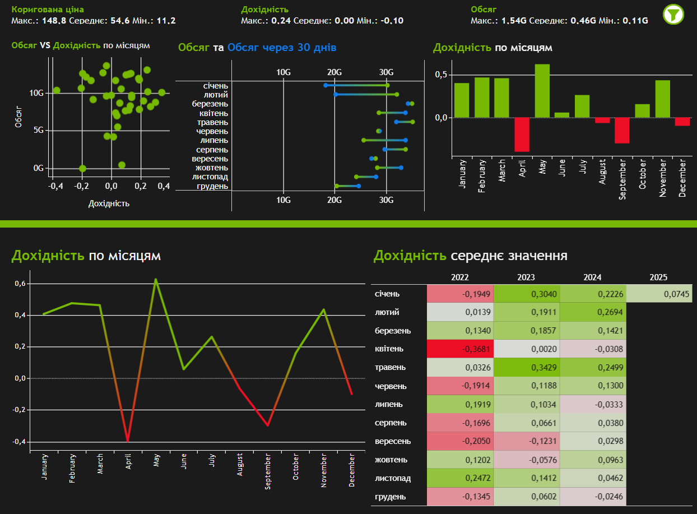

# Analyzing How GPU Search Trends Affect NVIDIA’s Stock Price
## Project Background
This project analyzes the relationship between the popularity of NVIDIA’s RTX 40 Series graphics cards and the company's stock performance. The core objective is to determine whether search interest data from Google Trends can provide useful auxiliary insights for investors analyzing NVIDIA stock dynamics.

Investing in technology stocks involves a wide range of technical and fundamental indicators. This project explores whether product-level popularity — measured in real time and at low cost — can act as a supplementary tool to observe market sentiment, anticipate movements, or contextualize volatility.

The analysis focuses on three key GPU models: RTX 4070, 4080, and 4090. By combining daily Google Trends data with stock data from Yahoo Finance (adjusted closing price, returns, and trading volume), the study performs a comprehensive correlation and lag analysis to examine potential dependencies and delayed effects.

Insights and findings are provided across the following dimensions:

- **Price vs Popularity:** Measuring whether increased interest in a GPU model correlates with stock price movement, and whether this effect is immediate or delayed.

- **Returns and Volume Dynamics:** Evaluating how GPU popularity relates to NVIDIA's trading activity and stock returns, both directly and with various time lags.

- **Seasonal Behavior:** Testing whether popularity and financial indicators display calendar-based patterns, such as end-of-year surges or summer slumps.

- **Model Comparison:** Identifying which of the RTX models demonstrates the strongest connection to market behavior, and whether flagship or mid-range products drive more impact.

A Tableau dashboard for interactive exploration of GPU popularity, price trends, and lag analysis is available [here](https://public.tableau.com/views/NVIDIApopularityandstocks/Trends?:language=en-US&:sid=&:display_count=n&:origin=viz_share_link).

A full text-based summary of all tested hypotheses and results is available in the analysis report [here](Testing%20hypotheses.pdf).

## Data Structure
The project integrates two types of data sources stored in PostgreSQL: GPU popularity data from Google Trends and financial stock data from Yahoo Finance. These datasets are organized into four separate tables and structured as follows:

The cleaned dataset can be found [here](./tables/pop_stocks_table.csv).

## Executive Summary
### Overview of Findings
This analysis investigates the relationship between the popularity of NVIDIA RTX 40 Series GPUs and the financial performance of NVIDIA stock, using data from Google Trends and Yahoo Finance. The study tested 30+ hypotheses combining price, returns, volume, and popularity across different time lags and seasonal contexts.

Key findings include:

- RTX 4070 shows the strongest and most stable correlation with stock price (up to 0.77), even without lag adjustment. It is the most reliable GPU indicator for market sentiment.

- RTX 4080 demonstrates a delayed market effect with significant correlations emerging after a 30-day lag (up to 0.78), suggesting slower market reaction.

- RTX 4090 shows very weak or no correlation with any stock metric, indicating that premium product hype does not translate into market impact.

- Popularity trends do not significantly affect returns or trading volume. Correlations for these metrics remained below 0.11 across all models and lags.

- Calendar month has minimal influence. Weak correlations with months (0.16–0.37 for popularity, ~0.23 for price) indicate seasonality is not a dominant factor.

- Google Trends popularity may act as a supplementary signal, not a predictive tool. It works best as context around other financial indicators.

These findings reveal which products correlate most with market movement, how long the market takes to respond to popularity, and when public interest aligns—or diverges—from investor behavior.

The insights can support investors, analysts, and fintech tools by providing an accessible way to track product traction and sentiment in real time.

Below is a snapshot from the interactive Tableau dashboard. The full report includes visual analysis, lag-based testing, seasonal breakdowns, and final conclusions based on all hypotheses. You can explore the full dashboard [here](https://public.tableau.com/views/NVIDIApopularityandstocks/Trends?:language=en-US&:sid=&:display_count=n&:origin=viz_share_link).

### Price Correlation
- RTX 4070 shows the strongest correlation with NVIDIA’s stock price, reaching up to 0.771 with no lag. The popularity of this model moves nearly in parallel with adjusted closing prices, making it the most consistent indicator among the RTX 40 Series.

- RTX 4080 displays a delayed relationship, with correlations strengthening at a 30-day lag (0.783). This suggests the market may react to RTX 4080 interest more slowly, possibly due to product segment positioning or delayed adoption cycles.

- RTX 4090, despite being the flagship model, has almost no correlation with price (0.07–0.10), implying that high-end hype does not translate into broad investor reaction.

These findings suggest that consumer-level interest in mid-range products (especially RTX 4070) is more reflective of market sentiment than premium or niche models. Investors looking for product-market resonance should focus on broader-reach GPUs.

### Return and Volume Dynamics
- Across all models and time shifts, correlation between GPU popularity and stock returns remained weak (≤ 0.11). Even after applying lags, search interest showed no meaningful relationship to NVIDIA's short-term or 30-day return performance.

- Trading volume exhibited a mild negative correlation with GPU popularity, especially for RTX 4070 and 4080 (around –0.3 to –0.45), suggesting that periods of heightened product attention may not lead to higher trading activity, and may even coincide with stabilization phases.

These results reinforce the idea that returns and volume are driven by broader financial and macroeconomic factors, rather than consumer interest alone.

### Lag Effects
- Lag analysis revealed that RTX 4080 benefits most from a 30-day delay, while RTX 4070 correlates strongly without any lag. This divergence suggests different consumer segments and market responses based on GPU tier.

- No significant improvements were observed for returns or volume even with lagged popularity.

Product-level lag modeling may be helpful for stock price monitoring, but not for predicting profitability or trade momentum.

### Seasonal Trends
- Adjusted stock price shows weak seasonality (correlation with month = 0.231), slightly increasing towards Q4 (October–December).

- GPU popularity increases in later months, with weak-to-moderate positive correlations for RTX 4090 (0.369), RTX 4080 (0.307), and RTX 4070 (0.166).

- Returns and volume show little to no seasonal dependence, with returns correlating negatively with months (–0.053) and volume showing mild decline toward year-end (–0.291).

These patterns indicate that while some seasonal accumulation of interest exists, calendar-based timing is not a reliable predictor of financial performance.

### Model Comparison
- **RTX 4070 is the most responsive and reliable model**, showing strong price correlation, stability without lag, and high user engagement in search behavior.

- RTX 4080 serves as a delayed indicator, **useful for longer-window trend monitoring**, but less actionable in real time.

- **RTX 4090 has minimal analytical value** for market performance and appears to attract attention without financial impact.

This differentiation highlights the importance of product segmentation even in financial sentiment analysis. Not all GPU models equally reflect or drive investor behavior.

### Recommendations
1. **Use RTX 4070 Popularity as a Real-Time Market Sentiment Signal**
Among all GPU models analyzed, RTX 4070 consistently demonstrated the strongest correlation with NVIDIA’s stock price, even without lag. Investors and fintech platforms should prioritize this signal when building dashboards, alerts, or monitoring product-driven sentiment.
This model serves as the most accessible and responsive proxy for gauging public interest with tangible market alignment.

2. **Incorporate Lag Indicators for RTX 4080 in Predictive Dashboards**
RTX 4080 showed delayed correlation effects, especially at a 30-day lag. For investors or analysts working with medium-term models, this GPU’s popularity may be a useful lagging sentiment indicator.
Implementing rolling window monitoring (7–30 days) can improve sensitivity to changing public interest that isn’t reflected in markets immediately.

3. **Avoid Relying on RTX 4090 for Predictive Analysis**
Despite its premium status, RTX 4090 demonstrated minimal influence on price, returns, or volume. It may still attract attention from tech enthusiasts, but its market impact appears limited.
For portfolio allocation or behavioral modeling, do not overweight this product in sentiment tracking.

4. **Treat Google Trends Popularity as a Supplementary, Not Predictive Tool**
Across the study, popularity trends were most useful when interpreted alongside other metrics (e.g., earnings dates, product launches, macro events).
Use popularity data to:
- validate investor sentiment,
- detect spikes in brand visibility,
- enrich broader financial monitoring.
It should not be used in isolation for decision-making.

5. **Reducing the impact of seasonality on product financial modelling**
Calendar-based seasonality (e.g., Q4 effects) had weak correlation with both stock price and GPU popularity.
Models focused purely on months will likely miss the true drivers of investor behavior. Instead, prioritize:
- event-based triggers (e.g., launch dates),
- earnings releases,
- marketing activity.
These factors better align with observed fluctuations.

6. **Expand to Competitor and Cross-Brand Search Analysis**
This project focused solely on NVIDIA’s RTX 40 Series. A broader competitive landscape analysis using search data from AMD, Intel, and general GPU queries (e.g., "best GPU", "GPU for gaming") can yield deeper insights into relative attention shifts.
This approach may help:
- detect market share changes in real time,
- adjust sector exposure,
- improve competitive benchmarking.

